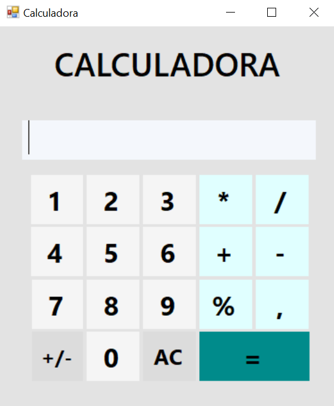

# Calculadora Simples
📚 Projeto acadêmico - Programador de Sistemas. 
Desenvolvido em C# utilizando Windows Forms no Visual Studio.

## Funcionalidades
- Soma (+)
- Subtração (-)
- Multiplicação (*)
- Porcentagem (%)
- Divisão (/)
- Botão +-
- Botão AC (Clear)
- Vírgula decimal

## Objetivo
Projeto criado para praticar lógica de programação e eventos no Windows Forms, utilizando vídeos como inspiração e implementando uma solução própria.

## 📸 Interface

